# Bill of Materials (BOM)

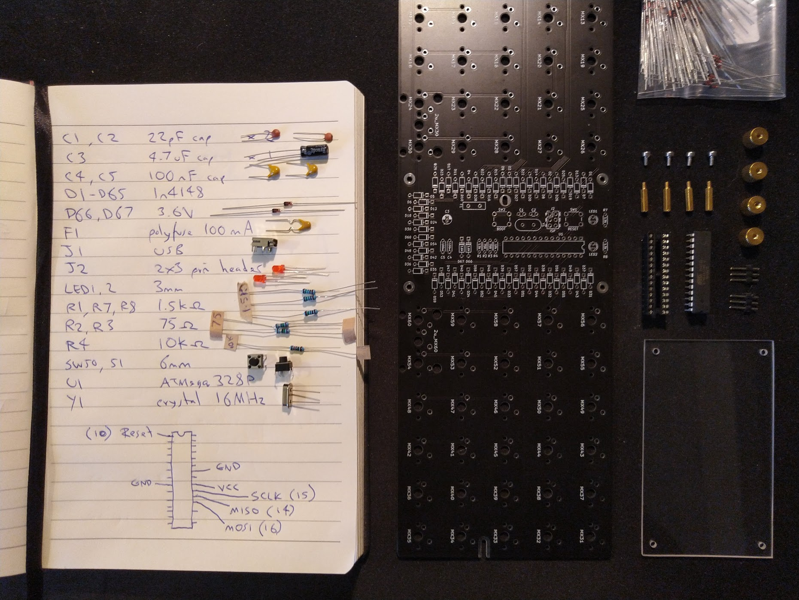

|                                    | Ref       | Qty | Value or Part# | Description                  |
|------------------------------------|-----------|-----|----------------|------------------------------|
| 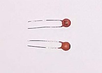      | C1,C2     | 2   | 22pF           | multilayer ceramic capacitor |
| 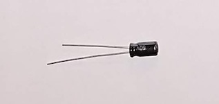           | C3        | 1   | 4.7uF 7mm      | electrolytic capacitor       |
| 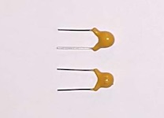      | C4,C5     | 2   | 100nF / 0.1uF  | multilayer ceramic capacitor |
|                                    | D1-60     | 60  | 1n4148         | diode                        |
| 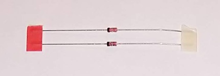  | D61,D62   | 2   | 3.6V           | zener diode                  |
| 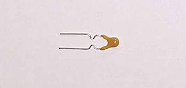           | F1        | 1   | 100mA          | polyfuse                     |
| 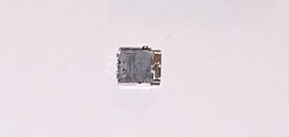     | J1        | 1   | XM7D-0512      | USB miniB connector          |
| 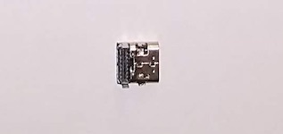   | J1        | 1   | USB4085-GF-A   | USB-C connector              |
|                                    | J2        | 1   | 2x3            | AVR ISP pin header           |
|  | LED1,LED2 | 2   | 3mm            | LED                          |
|                                    | MX1-60    | 60  | PCB mount      | MX keyboard switch           |
| 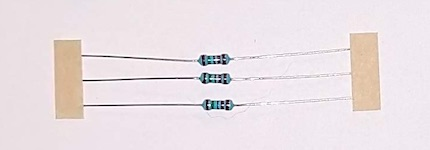 | R1,R7,R8  | 3   | 1.5kΩ          | resistor                     |
| 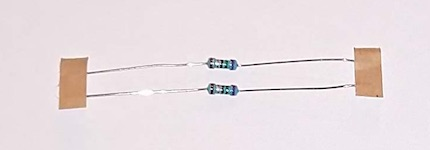      | R2,R3     | 2   | 75Ω            | resistor                     |
| 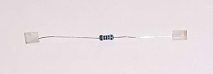           | R4        | 1   | 10kΩ           | resistor                     |
|       | R5,R6     | 2   | 5.1kΩ          | resistor for USB-C only      |
| 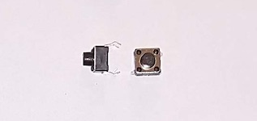   | SW1,SW2   | 2   | 6mm            | tactile switch               |
| 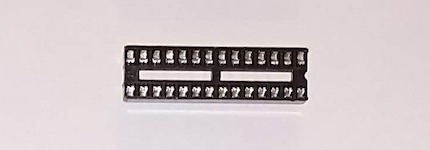           | IC socket | 1   | 28pin narrow   | IC socket                    |
| 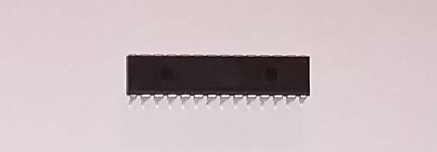           | U1        | 1   | ATMEGA328P-PU  | microcontroller              |
| 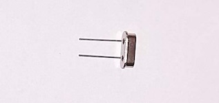           | Y1        | 1   | 16MHz          | crystal                      |
| 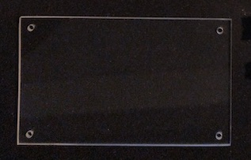     | cover     | 1   | 95x57x2mm      | acrylic component cover      |
|                                    | screw     | 8   | M2 8mm         |                              |
|                                    | standoff  | 4   | M2 10mm        |                              |

For your convienience, here is the [BOM on Octopart](https://octopart.com/bom-tool/0k8Ap0AF).
