# Bill of Materials (BOM)

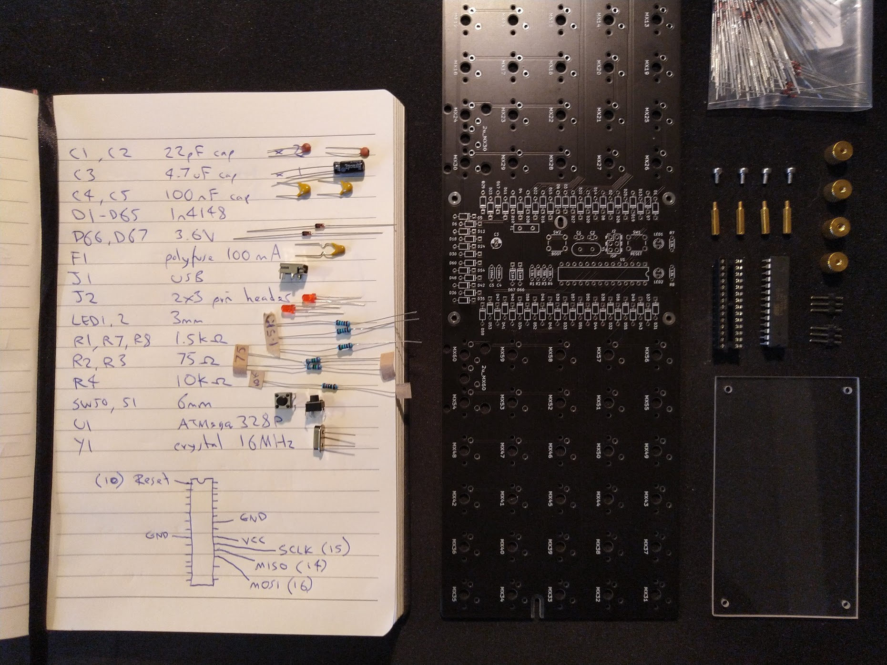

|                                      | Ref       | Qty | Value or Part# | Description                                | Vendor Store |
|--------------------------------------|-----------|-----|----------------|--------------------------------------------|--------------|
| 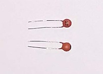        | C1,C2     | 2   | 22pF p2.5mm    | multilayer ceramic capacitor               |              |
| 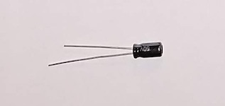             | C3        | 1   | 4.7uF p1.5mm   | electrolytic capacitor                     | [秋月電子 [JP]](https://akizukidenshi.com/catalog/g/g117895/) |
| 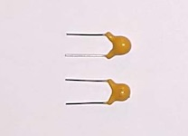        | C4,C5     | 2   | 100nF p5.0mm   | multilayer ceramic capacitor               |              |
| 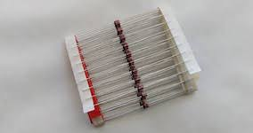       | D1-60     | 60  | 1n4148         | diode                                      | [秋月電子 [JP]](https://akizukidenshi.com/catalog/g/g100941/) |
| 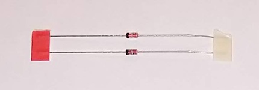    | D61,D62   | 2   | 3.6V           | zener diode                                | [秋月電子 [JP]](https://akizukidenshi.com/catalog/g/g115719/) |
| 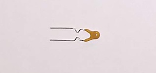             | F1        | 1   | 100mA          | polyfuse                                   | [秋月電子 [JP]](https://akizukidenshi.com/catalog/g/g112911/) |
| 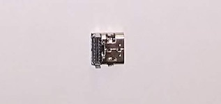       | J1        | 1   | TYPE-C-31-M-12 | USB-C connector                            | [Amazon [JP]](https://www.amazon.co.jp/dp/B09PKH9XZY) |
| 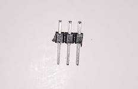             | J2        | 1   | 2x3 p2.54mm    | AVR ISP pin header (optional)              |              |
|              | J3        | 1   | SM04B-SRSS-TB  | JST connector (optional for daughterboard) |              |
|                                      | J5        | 1   | 781710004      | Molex Pico-EZmate connector (optional)     |              |
| 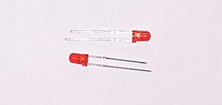  | LED1,LED2 | 2   | 3mm            | LED                                        | [秋月電子 [JP]](https://akizukidenshi.com/catalog/g/g111637/) (黄緑) / [秋月電子 [JP]](https://akizukidenshi.com/catalog/g/g111577/) (赤) |
| 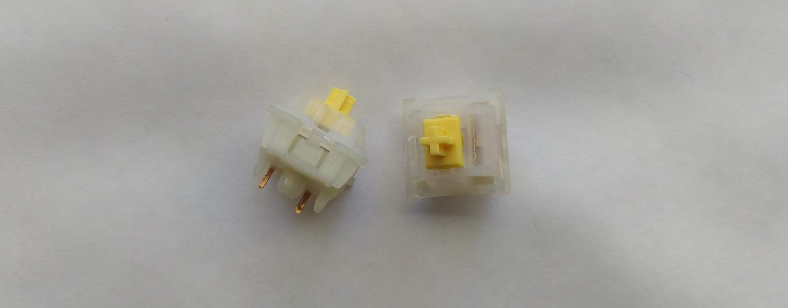     | MX1-60    | 60  | MX/Alps/Choc   | Keyboard switch                            |              |
|                                      | Mill-Max  | 120 | 3305-1         | Mill-Max socket (optional for hot-swap)    | [MOUSER [US]](https://www.mouser.jp/ProductDetail/575-3305115804720000) |
| 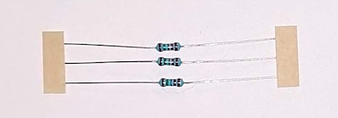   | R1,R7,R8  | 3   | 1.5kΩ          | resistor                                   | [秋月電子 [JP]](https://akizukidenshi.com/catalog/g/g116632/) |
| 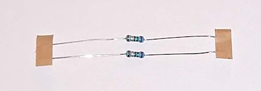        | R2,R3     | 2   | 75Ω            | resistor                                   | [秋月電子 [JP]](https://akizukidenshi.com/catalog/g/g116620/) |
| 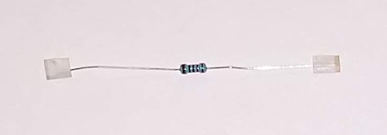             | R4        | 1   | 10kΩ           | resistor                                   | [秋月電子 [JP]](https://akizukidenshi.com/catalog/g/g108550/) |
| 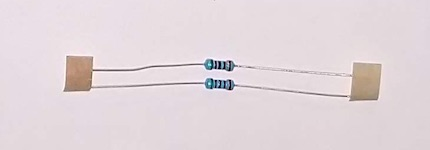        | R5,R6     | 2   | 5.1kΩ          | resistor for USB-C only                    | [秋月電子 [JP]](https://akizukidenshi.com/catalog/g/g108547/) |
| 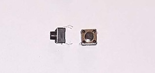     | SW1,SW2   | 2   | 6x6mm          | tactile switch                             | [MOUSER [US]](https://www.mouser.jp/ProductDetail/611-645SL70SMTR92LFS) |
| 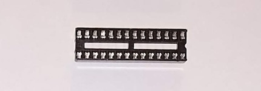             | IC socket | 1   | 28pin narrow   | IC socket                                  | [秋月電子 [JP]](https://akizukidenshi.com/catalog/g/g100013/) |
| 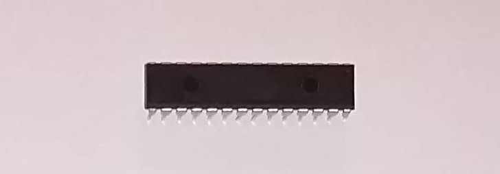             | U1        | 1   | ATMEGA328P-PU  | microcontroller                            | [MOUSER [US]](https://www.mouser.jp/ProductDetail/556-ATMEGA328P-PU) / [秋月電子 [JP]](https://akizukidenshi.com/catalog/g/g103142/) |
| 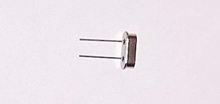             | Y1        | 1   | HC49-4H 16MHz  | crystal                                    | [MOUSER [US]](https://www.mouser.jp/ProductDetail/449-LFXTAL022786BULK) |
| 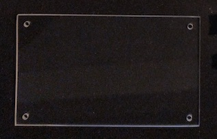       | cover     | 1   | 95x57x2mm      | acrylic component cover                    |              |
| 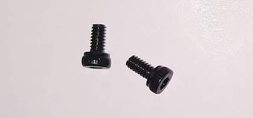       | screw     | 8   | M2 4mm         | screws for standoff                        |              |
| 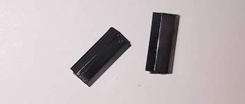 | standoff  | 4   | M2 10mm        | standoffs for component cover              |              |

For your convienience, here is the [BOM on Octopart](https://octopart.com/bom-tool/0k8Ap0AF).
