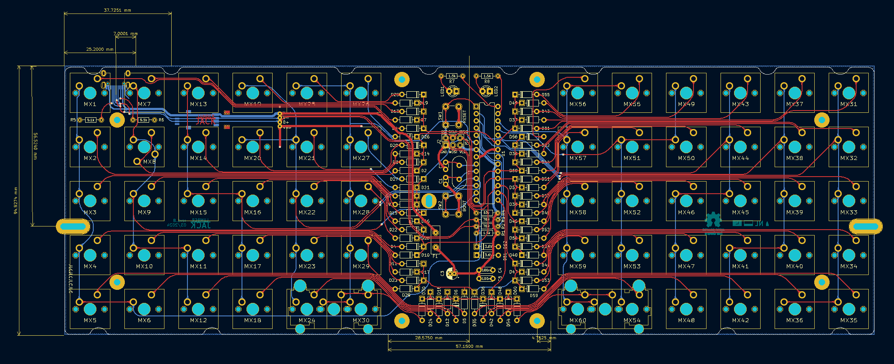

# Lumberjack - Through-hole ortholinear 60% keyboard PCB

Lumberjack is a split 5x12 ortholinear keyboard PCB using through-hole components only.

The goal of this project is to build an all through-hole component ortholinear PCB that fits in a standard 60% tray mount case.

Inspired by the [Plaid keyboard](https://github.com/hsgw/plaid).

* Designed to be easy to build with minimal soldering experience.
* All through-hole components, no SMD soldering required.
* Get that visible component aesthetic in a standard 60% tray-mount case.
* Plateless.

# Bill of Materials (BOM)

| Ref       | Num   | Description                                       |
|-----------|-------|---------------------------------------------------|
| C1,C2     | 2     | multilayer ceramic capacitor 22pF or 20pF         |
| C3        | 1     | electrolytic capacitor 4.7uF                      |
| C4,C5     | 2     | multilayer ceramic capacitor 100nF                |
| D1-65     | 65    | diode 1n4148                                      |
| D66,D67   | 2     | zener diode 3.6V                                  |
| F1        | 1     | polyfuse 100mA                                    |
| J1        | 1     | USB miniB connector Omron XM7D-0512 or equivalent |
| J2        | 1     | 2x3 pin header                                    |
| LED1,LED2 | 2     | 3mm LED                                           |
| MX1-65    | 62-65 | MX PCB mount (5 pin) keyboard switch              |
| R1,R7,R8  | 3     | resistor 1.5kΩ                                    |
| R2,R3     | 2     | resistor 75Ω                                      |
| R4        | 1     | resistor 10kΩ                                     |
| SW1,SW2   | 2     | 6mm tactile switch                                |
| U1        | 1     | ATMEGA328P                                        |
| Y1        | 1     | crystal 16MHz                                     |
| PCB       | 1     | see ordering details below                        |
| stab      | 0-2   | switch stabilizer for optional 2u keys            |
| cover     | 1     | acrylic component cover 95x57x2mm                 |
| screw     | 8     | M2 8mm                                            |
| standoff  | 4     | M2 10mm                                           |

# Ordering PCBs

PCBs can be manufactuered by a variety of online PCB fabricators. You can use [PCBShopper](https://pcbshopper.com/) to search for the best price.

The zip file in the gerber directory contains the gerber files your fabricator will need to make the PCB [lumberjack.zip](https://github.com/peej/lumberjack-keyboard/blob/master/gerber/lumberjack.zip) PCB.

When uploading the gerber zip files, use the default PCB settings.

# Construction

Solder all the components onto the top side of the PCB except the USB connector which should be on the back of the board. Leave the larger components until last so that the board will lie flat upsidedown while you solder the resistors and capacitors.

Take care to put the correct value resistors and capacitors in the correct places, the values are written on the silkmask along with the component reference. If you are unsure about the value of a resistor, check it with a multimeter.

Ensure that polarised components (diodes, LEDs, electrolytic capacitor (C3), IC socket) are in the correct orientation. The square pad is for the negative side of the component; for a diode this means the side with the black stripe; for LEDs and C3 the short leg is the cathode and goes in the square pad.

When fitting key switches, the switches at the 'Q' and 'P' positions on the 2nd row will fowl on the standoffs in your keyboard case, so you need to trim down one of the stabilizing pins and part of the center pin to ensure the PCB fits flush within the case.

If you are using a 2u key on the right hand side, you will also need to trim down the center pin so that it does not fowl on the standoff. The position the case standoffs will be is marked on the soldermask of the underside of the PCB.

Note also that the switches at the '1' and 'Q' positions are upsidedown so that the switch pins do not interfere with the USB connector or case standoffs.

# Bootloader

You will need to flash the microprocessor with a bootloader. To do this you will need another device which can be connected to the ISP headers and used to flash the bootloader to the chip. Since Lumberjack is the same as the Plaid, we can use the same bootloader.

* Download the [Plaid bootloader](https://github.com/hsgw/USBaspLoader/tree/plaid) and follow the instructions to compile the bootloader.
* Follow the [QMK ISP flashing guide](https://beta.docs.qmk.fm/using-qmk/guides/keyboard-building/isp_flashing_guide) to get the bootloader onto the chip.

# Firmware

To create firmware it is easist to start with a copy of the [Plaid firmware](https://github.com/qmk/qmk_firmware/tree/master/keyboards/dm9records/plaid) and adjust the configuration to have the following pin configuration:

| Configuration   | Value                                  |
|-----------------|----------------------------------------|
| MATRIX_ROWS     | 6                                      |
| MATRIX_COLS     | 10                                     |
| MATRIX_ROW_PINS | C0, B5, B4, B3, B2, B1                 |
| MATRIX_COL_PINS | B0, D7, D6, D5, D4, D1, D0, C1, C2, C3 |
| DIODE_DIRECTION | COL2ROW                                |

Due to the limited pin number of the ATMEGA328P, the PCB uses a 6 by 10 matrix (16 pins) instead of a 5 by 12 matrix (17 pins), this makes organising the matrix within QMK slightly more complicated. The image below shows pins for each key.

Follow the [QMK firmware instructions](https://beta.docs.qmk.fm/using-qmk/guides/flashing/flashing) to build and flash the firmware.

To put the board into bootloader mode so it is ready to recieve firmware, press and hold the BOOT button (SW2) while pressing and releasing the RESET button (SW1). The board will now be detected as an USBasp device and can have the firmware flashed via the USB port.

Pressing the RESET button (SW1) on its own will restart the microprocessor. Once flashed with firmware it is neccessary to reset the keyboard so as to return control to the new firmware.

Note that due to the BOOT button (SW2) sharing a pin with column 3, when pressed the keys in that column will also activate. This is expected behavour but can be a little annoying or confusing if you are not expecting it.

# Component cover

Cut a piece of 2mm thick acrylic to size (95x57mm) and drill 4 m2 holes in the corners for the standoffs. Use the PCB as a guide for the hole positions.

Affix the 4 standoffs to the PCB with screws from underneath the PCB. Use the remaining 4 screws to attach the acrylic to the top of the standoffs.

