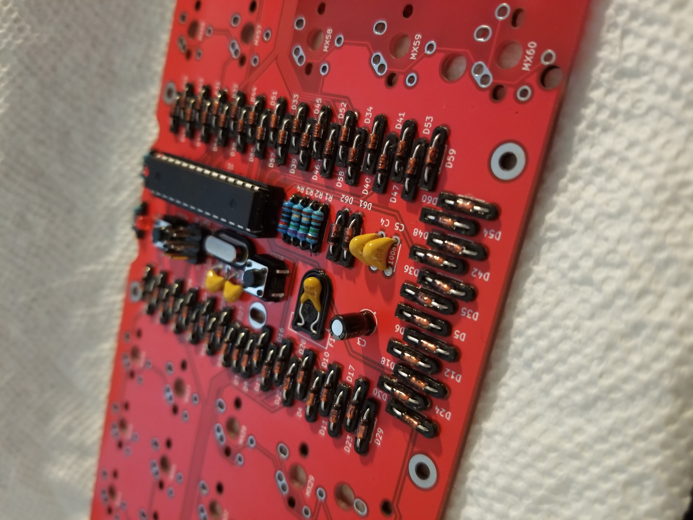

# Lumberjack - Through-hole ortholinear 60% keyboard PCB

Lumberjack is a split 5x12 ortholinear keyboard PCB using through-hole components only.

The goal of this project is to build an all through-hole component ortholinear PCB that fits in a standard 60% tray mount case.

Inspired by the [Plaid keyboard](https://github.com/hsgw/plaid).

* Designed to be easy to build with minimal soldering experience.
* Get that visible component aesthetic in a standard 60% tray-mount case.
* 12 pin USB-C or JST connector.
* Plateless or with FR4 switch plates.

# Ordering parts

See the [Bill of materials](BOM.md) for a detailed list of the required parts.

PCBs can be manufactuered by a variety of online PCB fabricators. You can use [PCBShopper](https://pcbshopper.com/) to search for the best price.

The [zip file in the gerber directory](https://github.com/peej/lumberjack-keyboard/blob/master/gerber/lumberjack.zip) contains the gerber files your fabricator will need to make the PCB.

When uploading the gerber zip files, use the default PCB settings.

Note that when uploading to JLCPCB, the upload tool may not detect the dimensions of the PCB from the gerber files and may not generate a preview image. This appears to be an issue with JLCPCB and you can manually enter the PCB size as 94.6x285mm.

If you want to use a plate, there are gerbers for an FR4 plate. You will need two plates, one for each half of the keyboard.

# Construction

Solder all the components onto the top side of the PCB except the USB connector which should be on the back of the board. Leave the larger components until last so that the board will lie flat upsidedown while you solder the resistors and capacitors.

Take care to put the correct value resistors and capacitors in the correct places, the values are written on the silkmask along with the component reference. If you are unsure about the value of a resistor, check it with a multimeter.

Ensure that polarised components (diodes, LEDs, electrolytic capacitor (C3), IC socket) are in the correct orientation. The square pad is for the negative side of the component; for a diode this means the side with the black stripe; for LEDs and C3 the short leg is the cathode and goes in the square pad.

See [the build guide](guide.md) for more information.

## Need help?

Have questions or need help, reach out via [our Discord server](https://discord.gg/cQ9EXqQmpE) where you will find many helpful Lumberjack owners.

# Firmware

Firmware is available in the QMK repository under the name `peej/lumberjack`.

Follow the [QMK firmware instructions](https://docs.qmk.fm/#/flashing) to build and flash the firmware.

To put the board into bootloader mode so it is ready to recieve firmware, press and hold the BOOT button (SW2) while pressing and releasing the RESET button (SW1). The board will now be detected as an USBasp device and can have the firmware flashed via the USB port.

Pressing the RESET button (SW1) on its own will restart the microprocessor. Once flashed with firmware it is neccessary to reset the keyboard so as to return control to the new firmware.

Note that due to the BOOT button (SW2) sharing a pin with column 3, when pressed the keys in that column will also activate. This is expected behavour but can be a little annoying or confusing if you are not expecting it.

## VIA

There is a VIA compatible firmware available in QMK. With this firmware flashed, the board will be automatically recognised by VIA when you plug it in.

## Bootloader

If you have a "raw" chip without a bootloader, you will need to compile and flash the bootloader onto the chip via another device. [See the build guide for more information](guide.md#bootloader).

## Matrix information

If you are building your own firmware, the following matrix information will be useful to you:

| Configuration   | Value                                  |
|-----------------|----------------------------------------|
| MATRIX_ROWS     | 6                                      |
| MATRIX_COLS     | 10                                     |
| MATRIX_ROW_PINS | C0, B5, B4, B3, B2, B1                 |
| MATRIX_COL_PINS | B0, D7, D6, D5, D4, D1, D0, C1, C2, C3 |
| DIODE_DIRECTION | COL2ROW                                |

Due to the limited pin number of the ATMEGA328P, the PCB uses a 6 by 10 matrix (16 pins) instead of a 5 by 12 matrix (17 pins), this makes organising the matrix in your firmware slightly more complicated. The image below shows pins for each key.

# Component cover

Cut a piece of 2mm thick acrylic to size (95x57mm) and drill 4 m2 holes in the corners for the standoffs. Use the PCB or cover.dxf as a guide for the hole positions, you can also use cover.dxf for laser cutting the correct size acrylic.

Affix the 4 standoffs to the PCB with screws from underneath the PCB. Use the remaining 4 screws to attach the acrylic to the top of the standoffs.

# Electronic component cradles

Want to give your components the comfort they need, right?

These 3d printable cradles for your electornic components provided by 
SuPaSeM#3659 (discord) will hold things in place, keep them neat and tidy, and cradle your components like a baby.

# Revisions

## Rev 1.1

* Fix cosmetic errors in silkscreen
* Increase resistor footprint size
* Fix R1 resistor connection to D-

## Rev 1.2

* Add JST socket footprint for USB daughterboard
* Rotate central mount hole 90 degrees

## Rev 1.3

* Add hybrid USB port footprint for mini and type C
* Fix numbering of zener diode footprints
* Flip MX7 to be south facing

## Rev 1.4

* Use USB footprint with better positioning
* Move 5.1k resistors to better location
* Change MX8 to allow both north and south facing switch
## Rev 1.5

* Change board outline to include cutouts for Bakeneko 60
* Re-route traces away from edges of the board
* Change MX footprints to MX/Alps/Choc combined footprint
* Add through-hole JST connector footprint
* Add silkscreen art to underside

## Rev 1.6

* Add mounting holes for standoffs so PCB can be used without a case

## Rev 1.7

* Change board outline to include cutouts for Cannon Keys Bakeneko and Singa Unikorn

## Rev 1.8

* Re-routed power and USB lines
* Change USB connector from THT to TYPE-C-31-M-12 SMD component
* Added fillets and curved traces
* Remove copper fill from top layer
